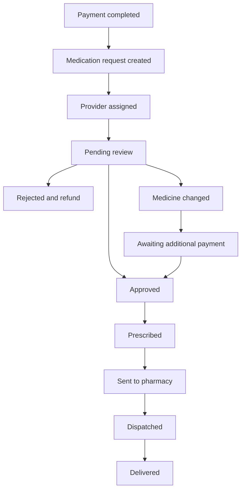

# Email notification catalog (Patient + Provider)

Transactional emails are **rendered in-repo** ([`src/lib/email.templates.ts`](../src/lib/email.templates.ts)) and **delivered via Brevo**. You only need `BREVO_API_KEY`, `BREVO_SENDER_EMAIL`, and `BREVO_SENDER_NAME` — no Brevo dashboard templates.

Missing config skips the send (logs a warning) and never fails the clinical action.

**Keep using Supabase Auth** for: login OTP, forgot password, patient password reset, provider invite / resend invite.

Providers also get **in-app** rows in `notifications` (DB trigger). Email is for offline practitioners.

---

## Wired in this repo

| Event | To | Hook | Template key |
|-------|-----|------|--------------|
| Consultation approved | Patient | `approveRequest` | `patient_approved` |
| Order rejected + refund | Patient | `rejectRequest` | `patient_rejected` |
| Additional payment required | Patient + Provider | `changeRequestMedicine` | `patient_additional_payment`, `provider_needs_attention` |
| Medicine changed (same/cheaper) | Patient | `changeRequestMedicine` | `patient_medicine_changed` |
| Prescription ready | Patient | `generatePrescription` | `patient_prescription_ready` |
| Sent to pharmacy / Shipped / Delivered | Patient | `advanceRequestStatus` | `patient_sent_to_pharmacy`, `patient_shipped`, `patient_delivered` |
| Refund approved / rejected | Patient | `approveRefund` / `rejectRefund` | `patient_refund_approved`, `patient_refund_rejected` |
| Provider assigned (+ ready for review if already pending) | Provider | `assignRequestProvider` | `provider_assigned`, `provider_ready_for_review` |

Skip provider email when the actor is the assigned provider (same rule as in-app notifications).

---

## Not wired here (outside this app’s server fns)

| Event | Why | Suggested next step |
|-------|-----|---------------------|
| **Order confirmed** | Created by DB trigger `create_medication_order_on_payment` | Patient portal / Stripe webhook / Edge Function calling `sendTransactionalEmail` with `patient_order_confirmed` |
| **Auto provider assign / pending_review** | Same SQL trigger + `notify_provider_on_request_change` | Edge Function or HTTP webhook → Brevo |
| **Additional payment received** | Patient portal / Stripe webhook | Call from that service |
| Subscription cancel, wallet, referral, admin ops | Other portals / lower priority | Add later |

---

## How to edit templates

1. Open [`src/lib/email.templates.ts`](../src/lib/email.templates.ts)
2. Update the builder for the template key you care about
3. Deploy — no Brevo dashboard changes

Delivery helpers: [`src/integrations/brevo/client.server.ts`](../src/integrations/brevo/client.server.ts) and [`src/lib/email.notifications.ts`](../src/lib/email.notifications.ts).

Env: see [`.env.example`](../.env.example) (`BREVO_API_KEY`, `BREVO_SENDER_EMAIL`, `BREVO_SENDER_NAME`).
